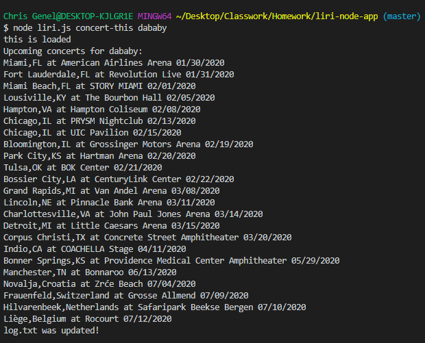
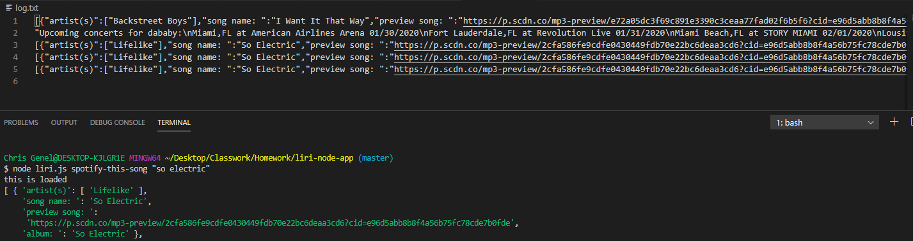
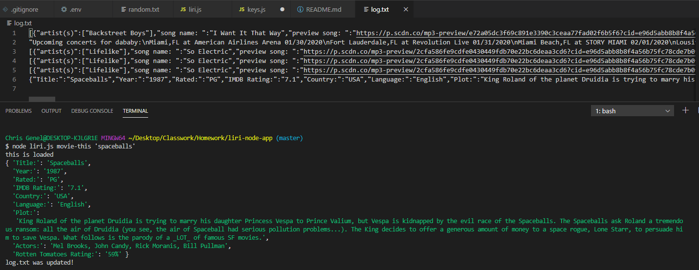
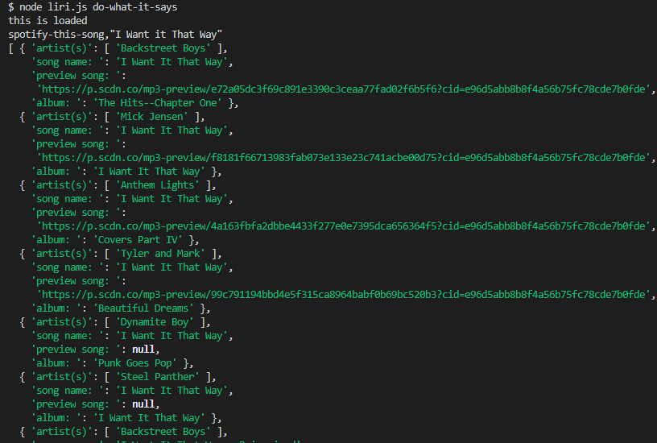

# liri-node-app
> This is my first attempt at coding a  _Language_ Interpretation and Recognition Interface similar to Siri for Apple products

## Table of Contents
- liri.js
- keys.js
- .gitignore
- .env
- random.txt
- package.json

## General Info
LIRI is a command line node app that takes in parameters and gives you back data. LIRI wiill search through several API's depending on which command you enter, Spotify for songs, Bands in Town for concerts, and OMDB for movies. I am using axios package to retrive data from bandsInTown. The command 'concert-this' will search the Bands in Town Artist Events API for an artist and render the name of the venue, the location and the date of the event. I am utilizing the 'node-spotify-api' package in order to retrieve song information from the Spotify API. The command 'spotify-this-song' will show the artist(s) of the song, the name of the song, a preview link from spotify, the album and if no song is provided it will default to "The Sign" by Ace of Base. I am using axios package to retrive data from OMDB. The command 'movie-this' will output the title of the movie, year, IMDB rating, the Rotten Tomatoes rating, country where it was produced, language of the movie, the plot, and actors. If the user doesn't type a movie in, the program will output data for the movie 'Mr. Nobody.' The command 'do-what-it-says', using the `fs` Node package, will take the text inside of random.txt and then use it to call one of LIRI's commands. In addition to logging the data to thr terminal/bash window, I have set the data to output to a .txt file called `log.txt`.

##Status
Project is: _Complete_